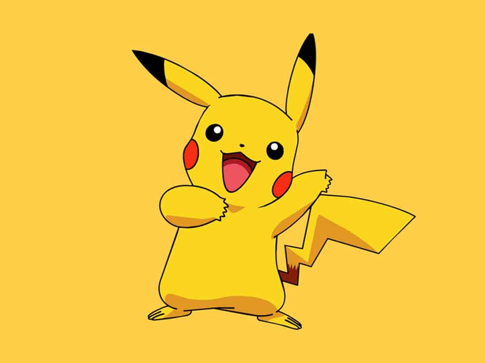
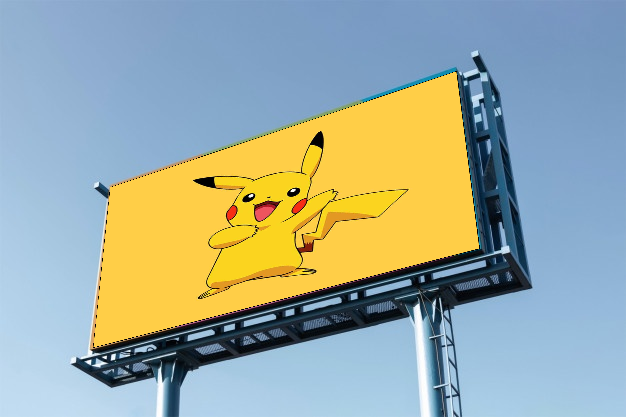

# Perspective Warping and Image Fusion 🌌🔮

This Python script allows you to perform perspective warping and image fusion between two images. It enables you to select four points on the base image, and then it warps and fuses the subject image onto the selected region of the base image. 🖼️🔍

## Prerequisites 🛠️🔧

To run this script, you need to have the following libraries installed:

- OpenCV (cv2) 📸
- NumPy 🧮

You can install the required libraries using pip: 

## Usage 🚀📝

1. Clone or download the repository. 📥

2. Navigate to the project directory. 📂

3. Run the Python script with the required arguments:

   

**Selecting the corner points**   
Every time you click on a point, the chosen point is highlighted using a red dot as shown below.  

  

## Output :
   

## Usage :

To run without debug enabled :-  
`python main.py --base_img base_img.jpg --subject_img subject.jpg`

To run with debug enabled :-  
`python main.py --base_img base_img.jpg --subject_img subject.jpg --debug True`

Enabling debug would allow you to visualize the intermediate masks and processed images so that 
you can better analyze where you're going wrong and remedy the problem accordingly.

## Notes 📝🚩

- Make sure the selected points form a convex polygon. Otherwise, the script may not produce the desired results. 🧩❌

- The subject image will be scaled to fit the selected region on the base image. The aspect ratio of the subject image may be distorted if the selected region is not a parallelogram. 🔍🔄🔮

- The script saves the final fused image as `Final_Output.png` in the project directory. 💾💼

---

Please make sure to include this `README.md` file with your project so that users can understand how to use the script effectively. 📝🆒

Do let me know if you face any issues. I'll do my best to help :)  
Happy Learning People ! Keep chasing your dreams ! ⭐️
